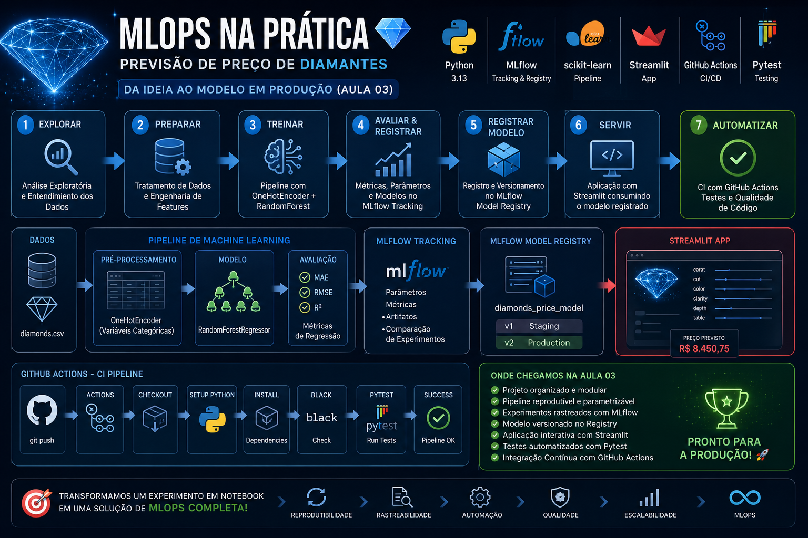

# Projeto MLOps - Previsão de Preço de Diamantes




Projeto desenvolvido durante a disciplina **MLOps - Running ML in Production Environments** da Faculdade Impacta.

O objetivo deste projeto é demonstrar a evolução de um experimento de Machine Learning realizado em notebook para uma solução reproduzível, automatizada e preparada para execução em ambientes de produção.

----------

# Evolução do Projeto

## Aula 01

Implementação inicial do fluxo de Machine Learning:

-   EDA
-   Feature Engineering
-   Treinamento
-   Avaliação
-   Registro de experimentos com MLflow

Resultado:

```
Notebook + MLflow
```

----------

## Aula 02

Organização do projeto:

-   Estruturação de diretórios
-   Separação da lógica de dados
-   Criação de módulos Python
-   Controle de dependências
-   Primeiro teste automatizado

Resultado:

```
Projeto organizado e reutilizável
```

----------

## Aula 03

Automação do ciclo de Machine Learning:

-   Pipeline de treinamento
-   OneHotEncoder
-   RandomForest
-   Argparse
-   MLflow Tracking
-   Model Registry
-   Streamlit
-   GitHub Actions
-   Testes automatizados

Resultado:

```
Pipeline Automatizado de Machine Learning
```

----------

## Próxima Etapa

### Aula 04

-   Deploy
-   Monitoramento
-   Data Drift
-   Observabilidade
-   Encerramento do projeto

----------

# Arquitetura Atual

```
                    ┌──────────────┐
                    │   Notebook   │
                    └──────┬───────┘
                           │
                           ▼
                    ┌──────────────┐
                    │  src/data.py │
                    └──────┬───────┘
                           │
                           ▼
                    ┌──────────────┐
                    │ Pipeline ML  │
                    │ OneHotEncoder│
                    │ RandomForest │
                    └──────┬───────┘
                           │
                           ▼
                    ┌──────────────┐
                    │   MLflow     │
                    └──────┬───────┘
                           │
                           ▼
                    ┌──────────────┐
                    │   Registry   │
                    └──────┬───────┘
                           │
                           ▼
                    ┌──────────────┐
                    │  Streamlit   │
                    └──────────────┘
```

----------

# Estrutura do Projeto

```
impacta-mlops/

├── app/
│   └── app.py
│
├── notebooks/
│   ├── EDA_diamond.ipynb
│   ├── 01_train.ipynb
│   └── 02_train.ipynb
│
├── src/
│   ├── __init__.py
│   ├── data.py
│   ├── model.py
│   ├── evaluate.py
│   └── train.py
│
├── tests/
│   ├── test_data.py
│   └── test_model.py
│
├── .github/
│   └── workflows/
│       └── ci.yml
│
├── mlruns/
│
├── requirements.txt
├── README.md
├── pytest.ini
└── .gitignore
```

----------

# Pipeline de Machine Learning

O treinamento foi encapsulado em um Pipeline do Scikit-Learn.

Etapas:

```
Dados
↓
OneHotEncoder
↓
RandomForestRegressor
↓
Predição
```

Benefícios:

-   Reprodutibilidade
-   Padronização
-   Menos código manual
-   Preparação para produção

----------

# Execução do Treinamento

Treinamento padrão:

```
python -m src.train
```

Treinamento com hiperparâmetro:

```
python -m src.train --max_depth 5
```

Exemplo:

```
python -m src.train --max_depth 8
```

----------

# MLflow

Iniciar o servidor:

```
mlflow server
```

Acessar:

```
http://localhost:5000
```

Recursos utilizados:

-   Tracking
-   Experiments
-   Metrics
-   Parameters
-   Model Registry

----------

# Model Registry

Após comparar os experimentos, o melhor modelo pode ser registrado.

Exemplo:

```
diamonds_price_model
```

O Registry permite:

-   Versionamento
-   Governança
-   Rastreabilidade
-   Gestão do ciclo de vida do modelo

----------

# Aplicação Streamlit

Executar:

```
streamlit run app/app.py
```

Acessar:

```
http://localhost:8501
```

Fluxo:

```
Usuário
↓
Streamlit
↓
MLflow Registry
↓
Modelo
↓
Previsão
```

----------

# Testes Automatizados

Executar:

```
pytest
```

Resultado esperado:

```
3 passed
```

Os testes validam:

-   Carregamento dos dados
-   Separação de treino e teste
-   Pipeline de Machine Learning

----------

# Integração Contínua

O projeto utiliza GitHub Actions.

Pipeline:

```
Git Push
↓
GitHub Actions
↓
Black
↓
Pytest
↓
Aprovação
```

Arquivo:

```
.github/workflows/ci.yml
```

----------

# Instalação

Criar ambiente virtual:

```
python -m venv .venv
```

Ativar:

```
.\.venv\Scripts\activate
```

Instalar dependências:

```
pip install uv

uv pip install -r requirements.txt
```

----------

# Conceitos Trabalhados

-   EDA
-   Feature Engineering
-   Reprodutibilidade
-   Versionamento
-   Organização de Projetos
-   Pipeline de Machine Learning
-   MLflow
-   Model Registry
-   Streamlit
-   Pytest
-   GitHub Actions
-   Continuous Integration
-   MLOps

----------

# Próximo Passo

Na Aula 04 iremos colocar o modelo em um cenário próximo da produção e discutir:

-   Deploy
-   Monitoramento
-   Data Drift
-   Observabilidade
-   Governança Operacional
-   Evolução contínua de modelos