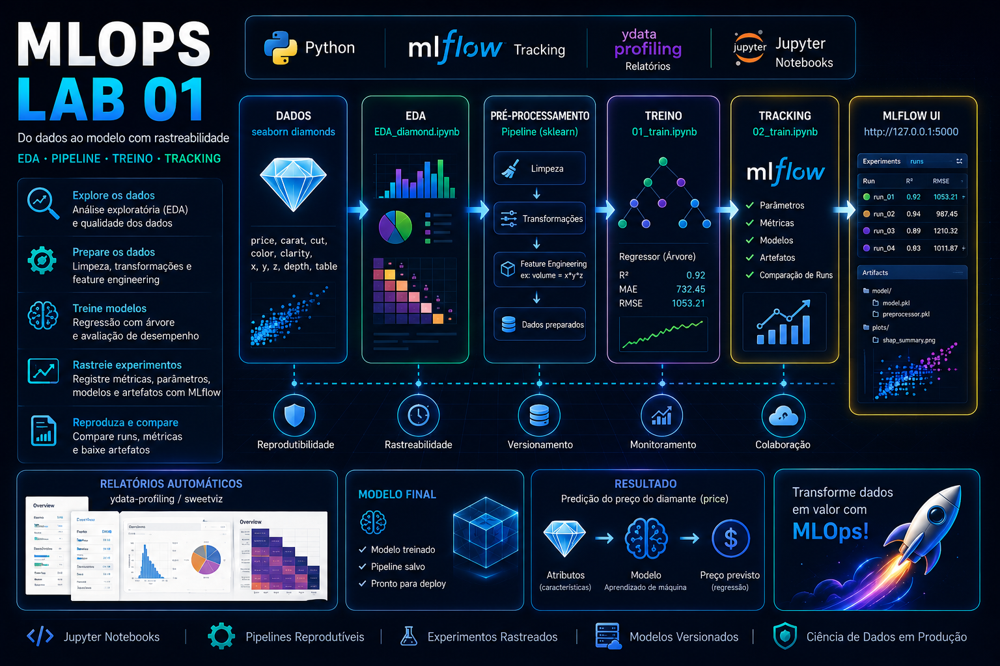

# Atividade 1 - MLOps (Faculdade Impacta)


Material de laboratório para a disciplina de MLOps da Faculdade Impacta. O repositório demonstra um fluxo prático: EDA, feature engineering, treino de modelo e registro de experimentos com MLflow — pensado também como peça de portfólio.



---

# O que você irá aprender

Ao concluir esta atividade, você será capaz de:

- Realizar uma Análise Exploratória de Dados (EDA) sistemática e documentada.
- Construir pipelines reprodutíveis para limpeza e pré-processamento.
- Treinar modelos de regressão (ex.: árvore) e avaliar com métricas relevantes.
- Registrar experimentos e artefatos com MLflow.
- Gerar relatórios automáticos de profiling (ydata-profiling/sweetviz).
- (Opcional) Executar componentes localmente.

---

# Arquitetura da Solução

O fluxo do laboratório é simples e centrado em notebooks:

```text
	Dados (seaborn diamonds)
		  │
		  ▼
	  EDA_diamond.ipynb
		  │
		  ▼
	Pré-processamento (pipeline)
		  │
		  ▼
	  01_train.ipynb  ---> (local model artifacts)
		  │
		  ▼
	  02_train.ipynb  ---> (registra runs no MLflow)
		  │
		  ▼
	  MLflow UI (tracking + artifacts)
```

---

# Tecnologias Utilizadas

| Tecnologia | Finalidade |
|------------|------------|
| Python     | Linguagem de programação |
| Jupyter Notebooks | Desenvolvimento e documentação interativa |
| MLflow     | Tracking de experimentos, artifacts e model registry |
| ydata-profiling / sweetviz | Relatórios automáticos de EDA |

---

# Estrutura do Repositório

```text
.
├── EDA_diamond.ipynb
├── 01_train.ipynb
├── 02_train.ipynb
├── docs/MLFLOW_SETUP.md
├── requirements.txt
├── .gitignore
└── assets/
	└── lab01.svg
```

| Arquivo | Descrição |
|---------|-----------|
| `EDA_diamond.ipynb` | Notebook com análise exploratória e comentários. |
| `01_train.ipynb` | Treinamento do modelo (sem tracking). |
| `02_train.ipynb` | Treinamento com registro de experimentos no MLflow. |
| `docs/MLFLOW_SETUP.md` | Guia para instalação e execução do MLflow local. |

---

# Descrição da Atividade

O objetivo é prever o preço dos diamantes (variável `price`) usando atributos como `carat`, `cut`, `color`, `clarity`, `x`, `y`, `z`, `depth`, `table`. O material foca em:

- Exploração e limpeza dos dados.
- Criação de features (ex.: `volume = x*y*z`).
- Treinamento e avaliação de modelos de regressão.
- Registro e comparação de runs no MLflow.

---

# Fluxo de Trabalho (resumo)

1. Abrir `EDA_diamond.ipynb` e executar células de EDA e limpeza.
2. Implementar transformações e salvar pipeline reutilizável.
3. Rodar `01_train.ipynb` para treinar e avaliar localmente.
4. Rodar `02_train.ipynb` para registrar os experiments no MLflow.
5. Abrir MLflow UI e comparar runs / baixar artefatos.

---

# Pré-requisitos

- Python 3.8+ (recomendado 3.10+)
- pip
- (Opcional) Docker Desktop para executar Tracking Server em container
- Git (opcional)

---

# Execução Local

## 1. Criar ambiente virtual (opcional)

```powershell
python -m venv .venv
.\.venv\Scripts\Activate.ps1
```

## 2. Instalar dependências

```powershell
pip install uv
uv pip install -r requirements.txt
```

## 3. Executar notebooks

Abra JupyterLab/Notebook e execute `EDA_diamond.ipynb`, `01_train.ipynb` e `02_train.ipynb` na ordem.

## 4. Iniciar MLflow UI (para `02_train.ipynb`)

```powershell
mlflow ui --port 5000
# abrir http://127.0.0.1:5000
```

---

# Conceitos Trabalhados

- EDA e qualidade de dados
- Feature engineering e transformações
- Pipeline reprodutível (sklearn)
- Treinamento e avaliação de modelos de regressão
- Tracking de experimentos com MLflow
- Relatórios automáticos de profiling

---

# Exercícios Propostos

1. Criar `volume = x*y*z`, testar correlação e impacto no modelo.
2. Gerar relatório `ydata-profiling` e incluir em `reports/`.
3. Adicionar explicabilidade com SHAP e documentar insights.
4. Versionar dados com DVC e salvar artefatos em storage remoto (opcional).

---

# Solução de Problemas

## MLflow UI não aparece na porta 5000

Verifique se a porta está ocupada:

```powershell
netstat -ano | findstr :5000
```

## Erros ao instalar dependências

Atualize o `pip` e use um ambiente virtual:

```powershell
python -m pip install --upgrade pip
pip install -r requirements.txt
```

---

# Conclusão

Este repositório serve tanto como material de laboratório quanto como um exemplo prático para portfólio.
